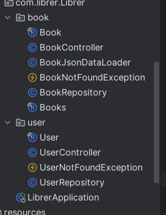
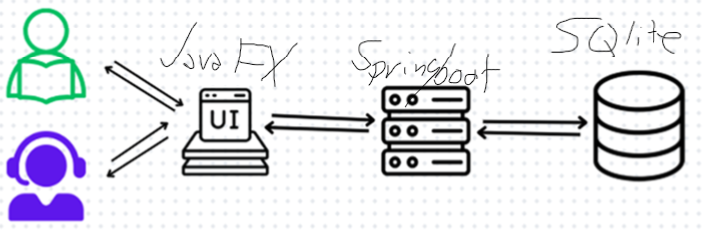
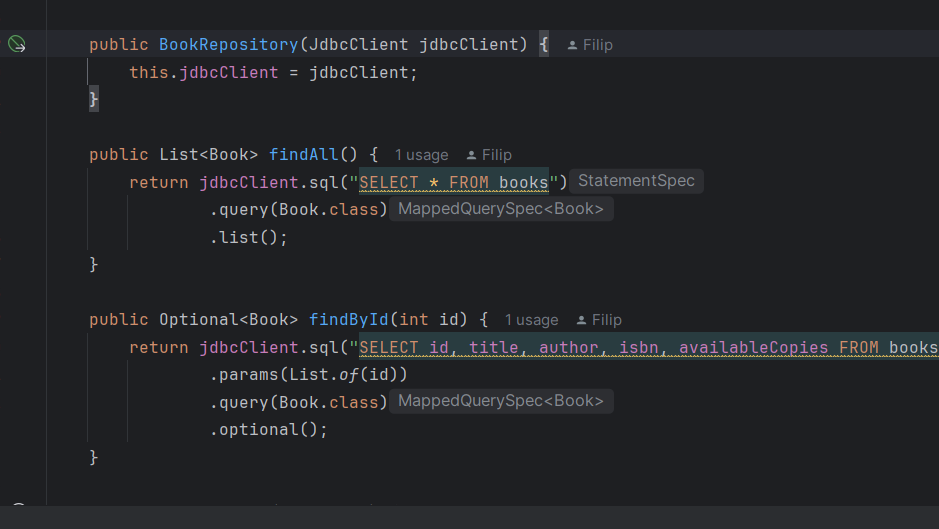
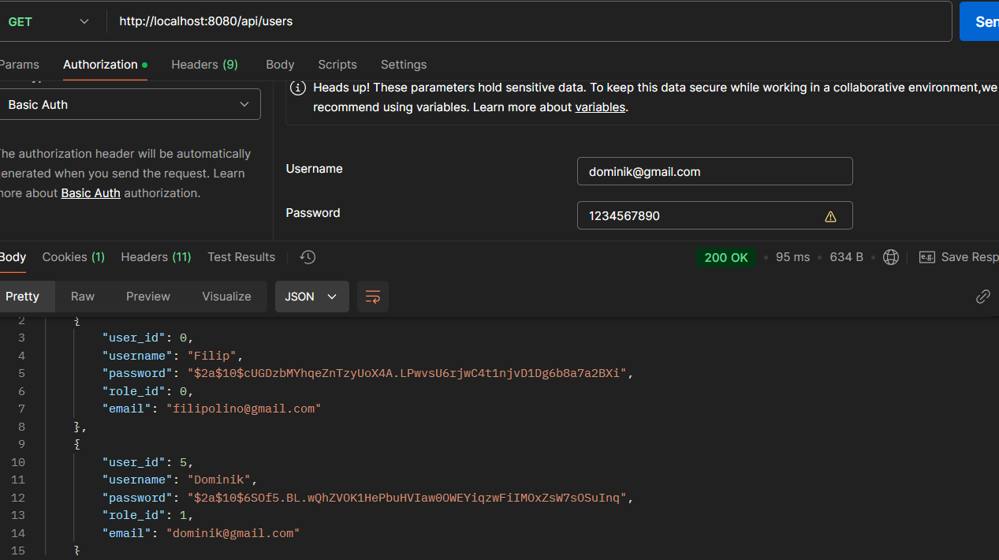
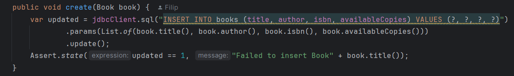
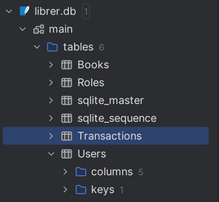

Project Overview: A brief description of the library management system, highlighting user roles and application goals, Please use images in the README.md file.

Technology Stack: A breakdown of chosen technologies—JavaFX for the user interface, Spring Boot for backend logic, SQLite for data management, and RESTful APIs for client-server communication.

Classes and Functions: Clear documentation of key classes and methods, outlining each class’s role and detailing essential functions like addBook(), borrowBook(), and listBooks().

RESTful API: An explanation of the endpoints used, with HTTP methods for core actions (GET, POST, PUT, DELETE).

Database Design: A description of the relational database structure, including Users, Books, and Roles tables, and how these support the system’s operations. ( Please use visuals to demonstrate this) 

User Interface: A summary of JavaFX screens for the user and administrator, with sample images to illustrate application workflow.

Challenges and Approach: Document any challenges faced, such as implementing secure communication or preventing SQL injection, and their approach to overcoming them.
