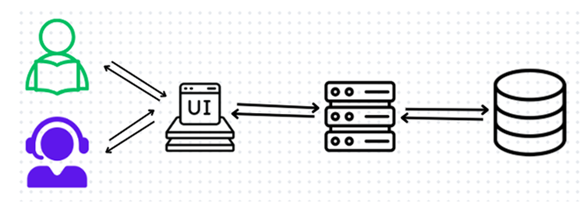

# Library Management System

## Project Overview

This application is a comprehensive library management system designed to streamline book inventory and borrowing processes. It features two main user roles:

1. **User**: Can search for and borrow books.
2. **Administrator**: Can manage the book inventory, including adding, updating, and removing books.

The primary goal of this system is to offer a user-friendly interface for efficient library operations.

---

## Technology Stack

- **Frontend**: JavaFX for an interactive and visually appealing user interface.
- **Backend**: Spring Boot to manage business logic and RESTful APIs.
- **Database**: SQLite for lightweight and efficient data storage.
- **APIs**: RESTful APIs ensure smooth communication between the client and server.

---

## Classes and Functions

### Key Classes:
1. **`Book`**: Represents a single book in the system, containing properties such as `title`, `author`, `isbn`, and `availableCopies`.
    - `Book.java`: [View Source Code](src/main/java/com/librer/Librer/book/BookRepository.java)

2. **`BookRepository`**: Handles all database operations related to books.
    - Key Methods:
        - `findAll()`: Retrieves all books from the database.
        - `findById(int id)`: Fetches a book by its ID.
        - `create(Book book)`: Adds a new book to the database.
        - `update(Book book, int id)`: Updates details of an existing book.
        - `delete(int id)`: Deletes a book by ID.
    - [View Source Code](src/main/java/com/librer/Librer/book/BookRepository.java)

3. **`Books`**: A wrapper class for lists of books.
    - [View Source Code](src/main/java/com/librer/Librer/book/Books.java)

---

## RESTful API

### Endpoints:
- **CREATE** `/books`: Adds a new book.
- **READ** `/books`: Fetches all books.
- **UPDATE** `/books/{id}`: Updates an existing book.
- **DELETE** `/books/{id}`: Deletes a book.

These endpoints allow CRUD operations on the book inventory.

---

## Database Design

The database consists of four main tables:

1. **Users**: Stores user information and roles.
2. **Books**: Stores details about books, such as title, author, and availability.
3. **Roles**: Defines user permissions.
4. **Transactions**: Records all book transactions, including borrowing and returning.

---

## User Interface

### Key Screens:
1. **User Dashboard**: Allows users to browse and borrow books.
2. **Admin Panel**: Provides administrators with tools to manage the inventory.

Login and register screen

If an administrator logs in, the main administrator dashboard is displayed.

The user's transactions can be displayed by double-clicking on the user's name.

If a user logs in, the main user dashboard is displayed.

A user can also borrow two or more copies of the same book.

---

## Challenges and Approach

### Challenges:
1. **Secure Communication**: Preventing unauthorized access and data leaks.
2. **SQL Injection**: Ensuring all database operations are secure.

### Solutions:
- Implemented parameterized queries to avoid SQL injection.
- Used Spring Security for robust access control.

---

